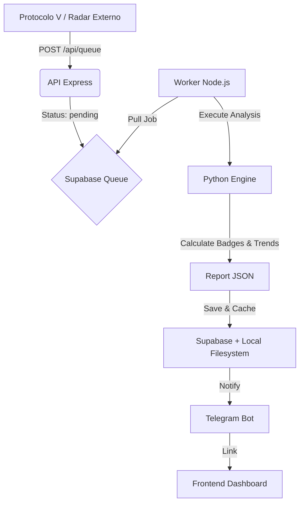

# Oráculo V | Contexto do Projeto

## Visão Geral do Domínio

O **Oráculo V** é o componente de inteligência e análise tática do ecossistema **Protocolo V**. Enquanto o Protocolo V atua como a plataforma central de gerenciamento e recrutamento de talentos em Valorant, o Oráculo V funciona como o "cérebro" analítico, processando dados brutos de partidas para extrair insights profundos sobre o desempenho de jogadores.

Sua principal missão é transformar estatísticas frias (KDA, ADR, Econ) em métricas táticas interpretáveis, como a consistência através do modelo **Holt-Winters**, badges de mérito tático (ex: "Clutch King", "Entry Fragger") e tendências de evolução de performance.

## Decisões Arquiteturais

O sistema foi concebido sob princípios de microserviços, escalabilidade e separação clara de responsabilidades:

1.  **Arquitetura Baseada em Fila (Producer-Consumer)**:
    -   As requisições de análise não são processadas de forma síncrona. A API (Producer) enfileira tarefas no Supabase, que são consumidas pelo Worker (Consumer) conforme a disponibilidade de recursos.
2.  **Tecnologia Híbrida**:
    -   **Node.js (Express)**: Utilizado para a API de alta performance e orquestração do Worker.
    -   **Python**: Implementado para o motor de análise estatística pesada (`analyze_valorant.py`), aproveitando bibliotecas de ciência de dados para cálculos de tendências.
3.  **Persistência em Supabase (Dual-Database)**:
    -   O Oráculo mantém seu próprio estado de fila e cache de análises.
    -   Ele consome dados de jogadores diretamente do banco de dados centralizado do Protocolo V para garantir a integridade da identidade dos agentes.
4.  **Cache de Relatórios**:
    -   Resultados de análises concluídas são persistidos tanto no Supabase quanto no sistema de arquivos local (`/analyses`) para entrega ultrarrápida.
5.  **I/O Não-Bloqueante**:
    -   Todo o core do sistema utiliza chamadas assíncronas (`fs.promises`), garantindo que o Event Loop nunca seja bloqueado durante operações de disco.
6.  **Otimização de Recursos (Singleton)**:
    -   Uso de instâncias únicas de Browser (Puppeteer) para maximizar o aproveitamento de RAM/CPU em alta carga.

## Fluxo de Dados Macro (Pure Consumer)

## Responsabilidades dos Componentes

-   `server.js`: Gateway de entrada protegida (Express), validação de inputs e consulta de status. Oferece o modo `AUTO` para expansão de partidas.
-   `worker.js`: Gerenciador de ciclo de vida do job (Daemon assíncrono). Gerencia o estado **Holt-Winters** e integra com Telegram.
-   `analyze_match.js`: Orquestrador de análise que baixa dados da partida, consulta o meta (VStats) e coordena a execução do motor Python.
-   `analyze_valorant.py`: Motor de análise tática puro (Python). Implementa o Lexicon of Impact, gera badges e calcula tendências.
-   `lib/supabase.js`: Gerenciador centralizado de conectividade dual-database (Oráculo + Protocolo).
-   `/scripts`: Repositório de ferramentas de manutenção, auditoria e sanitização de dados.
