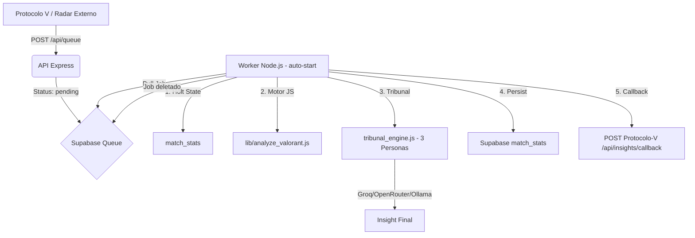

# Oraculo V | Contexto do Projeto (v5.1)

## Visao Geral do Dominio

O **Oraculo V** e o componente de inteligencia e analise tatica do ecossistema **Protocolo V**. Enquanto o Protocolo V atua como a plataforma central de gerenciamento e recrutamento de talentos em Valorant, o Oraculo V funciona como o "cerebro" analitico, processando dados brutos de partidas para extrair insights profundos sobre o desempenho de jogadores.

Sua principal missao e transformar estatisticas frias (KDA, ADR, Econ) em metricas taticas interpretaveis, como o **Performance Index** contextual por classe de agente, classificacao em **tres ranks tecnicos** (Alpha, Omega, Deposito de Torreta) e tendencias de evolucao via modelo **Holt-Winters**.

## Decisoes Arquiteturais

O sistema foi concebido sob principios de microservicos, escalabilidade e separacao clara de responsabilidades:

1.  **Arquitetura Baseada em Fila (Producer-Consumer)**:
    -   As requisicoes de analise nao sao processadas de forma sincrona por padrao. A API (Producer) enfileira tarefas no Supabase, que sao consumidas pelo Worker (Consumer) que inicia automaticamente com o servidor.

2.  **Motor 100% JavaScript Nativo (v5.0+)**:
    -   Todo o calculo estatistico (Performance Index, Holt-Winters, classificacao por role) e feito em `lib/analyze_valorant.js`. O motor Python foi abandonado na v5.0 para eliminar o overhead de spawn de processos e unificar a codebase.

3.  **Tribunal Engine (Motor LLM Adversarial)**:
    -   O sistema de IA utiliza 3 personas (Perspectiva Aliada, Perspectiva Rival, Mentor K.A.I.O.) para gerar insights de coaching tatico com multiplas perspectivas. Utiliza cadeia de fallback: Groq -> OpenRouter -> Ollama local.

4.  **Persistencia em Supabase (Banco Soberano)**:
    -   O Oraculo mantem seu proprio banco com fila (`match_analysis_queue`) e stats (`match_stats`). Comunicacao com Protocolo-V e feita via Webhook (callback REST).
    -   Fallback: se o webhook falhar, tenta persistencia direta no banco do Protocolo via `PROTOCOL_SUPABASE_URL` (se configurado).

5.  **Cache de Relatorios**:
    -   Resultados sao persistidos tanto no Supabase quanto no sistema de arquivos local (`/analyses` e `/matches`) para entrega ultrarrapida.

6.  **Scraping via Puppeteer (Singleton)**:
    -   Uso de instancia unica de Browser (Puppeteer) para obter dados do tracker.gg, maximizando o aproveitamento de RAM/CPU.

## Fluxo de Dados Macro (v5.1)

```mermaid
graph TD
    A[Protocolo V / Radar Externo] -- "POST /api/queue" --> B(API Express)
    B -- "Status: pending" --> C{Supabase Queue}
    D[Worker Node.js - auto-start] -- "Pull Job" --> C
    D -- "1. Holt State" --> E[match_stats]
    D -- "2. Motor JS" --> F[lib/analyze_valorant.js]
    D -- "3. Tribunal" --> G[tribunal_engine.js - 3 Personas]
    G -- "Groq/OpenRouter/Ollama" --> H[Insight Final]
    D -- "4. Persist" --> I[Supabase match_stats]
    D -- "5. Callback" --> J[POST Protocolo-V /api/insights/callback]
    D -- "Job deletado" --> C
```

## Responsabilidades dos Componentes

-   `server.js`: Gateway de entrada (Express) com validacao de inputs, consulta de status, chat com K.A.I.O. e health checks. Inicia o Worker automaticamente ao subir.
-   `worker.js`: Consumer assincrono da fila (loop infinito). Gerencia o ciclo de vida dos jobs e orquestra a pipeline de analise + IA + callback.
-   `analyze_match.js`: Orquestrador que baixa dados da partida (via Puppeteer/tracker.gg), consulta o meta (VStats) e coordena o motor JS.
-   `lib/analyze_valorant.js`: Motor matematico puro (JS). Fonte unica de verdade — calcula Performance Index contextual, ranks tecnicos e tendencias Holt-Winters.
-   `lib/tribunal_engine.js`: Motor LLM adversarial com 3 personas (Aliado, Rival, Mentor K.A.I.O.).
-   `lib/openrouter_engine.js`: Motor LLM de fallback e validacao anti-alucinacao.
-   `lib/tactical_knowledge.js`: Base tatica completa (agentes, mapas, arsenal, sites validos).
-   `lib/supabase.js`: Conexao soberana ao banco do Oraculo (single database).
-   `monitor_queue.js`: Script de monitoramento do estado da fila.
-   `/scripts`: Ferramentas de manutencao, auditoria e sanitizacao de dados.
