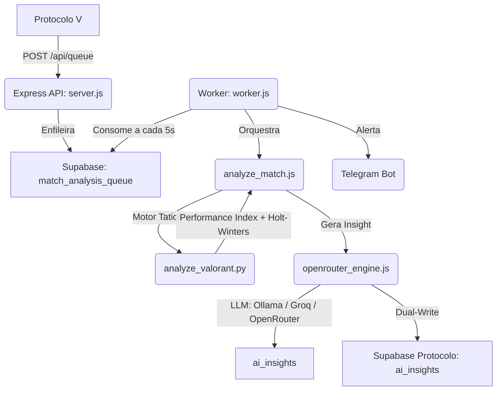

# ORACULO V // MOTOR DE INTELIGENCIA TATICA v4.1

> Motor de analise tatica independente para o ecossistema Protocolo V.
> Transforma dados brutos de combate do Valorant em inteligencia estrategica via pipeline hibrido Node.js + Python + LLM.

---

## Arquitetura

O Oraculo V e um **Service Provider** stateless. Recebe briefings de combate, processa e devolve insights. Nao retona dados de jogadores a longo prazo.



### Dual-Database

O sistema mantem duas conexoes Supabase simultaneas:
- **Oraculo DB** (primario): `match_stats`, `ai_insights`, fila de processamento
- **Protocolo DB** (espelho): `ai_insights` mirror para o frontend consumir sem depender do Oraculo

---

## Motor de Analise

### Performance Index (Role-Aware)

```
Performance Index = (KD_Peso x KD% + ADR_Peso x ADR% + KAST_Peso x KAST%) x 100
```

| Classe | KD Peso | ADR Peso | KAST Peso | ADR Baseline |
|---|---|---|---|---|
| **Duelista** | 40% | 40% | 20% | 160 |
| **Iniciador** | 35% | 35% | 30% | 140 |
| **Controlador** | 30% | 30% | 40% | 120 |
| **Sentinela** | 30% | 30% | 40% | 110 |

**K/D Alvo**: Obtido dinamicamente via vStats.gg filtrado por agente/mapa/rank.

### Classificacao em 3 Tiers

| Tier | Performance Index | Significado |
|---|---|---|
| **Alpha** | >= 115 | 15%+ acima da meta. Execucao de elite. |
| **Omega** | 95 - 114 | Dentro do esperado para a funcao. |
| **Deposito de Torreta** | < 95 | Abaixo da meta. Correcao necessaria. |

### Holt-Winters Double Exponential Smoothing

Rastreia evolucao temporal de 3 metricas (Performance Index, K/D, ADR):

- **Level**: `L_t = 0.4 x y_t + 0.6 x (L_prev + T_prev)`
- **Trend**: `T_t = 0.2 x (L_t - L_prev) + 0.8 x T_prev`
- **Forecast**: `L_t + T_t`

Estado persistido na tabela `players` do Protocolo V (`performance_l`, `performance_t`, `kd_l`, `kd_t`, `adr_l`, `adr_t`).

### Deteccao Tatica

- **Trade Kills**: Aliado morreu em ate 5000ms antes/depois do abate do jogador
- **First Bloods**: Primeiro abate do round contextualizado por funcao
- **Clutches**: Vitorias solo em situacao de desvantagem numerica
- **Economia**: Kills em eco round, vitorias em force buy

### Pipeline de LLM (3 Camadas de Fallback)

```
1. LOCAL (Ollama)     — Sem custo, baixa latencia, prioridade maxima
2. GROQ (Cloud)       — Llama 3.3 70B, free tier, fallback rapido
3. OPENROUTER (Cloud) — Gemini Flash / DeepSeek / Mistral / Phi-3 / Qwen (free)
4. FALLBACK JSON      — Estrutura derivada do motor Python (sem LLM)
```

**Anti-Alucinacao**: Quality Guard valida habilidades do agente, callouts do mapa, termos banidos e caracteres nao-latinos antes de aceitar qualquer insight.

---

## API Endpoints

### Publicos

| Metodo | Rota | Descricao |
|---|---|---|
| `POST` | `/api/queue` | Enfileira analise (retorna 202 imediato) |
| `POST` | `/api/analyze` | Analise sincrona (bloqueia ate concluir) |
| `GET` | `/api/status/:matchId?player=tag` | Consulta status/resultado |
| `GET` | `/api/health` | Health check com metricas de fila |
| `GET` | `/api/ping` | Verificacao de conectividade |

### Admin (requer header `x-api-key`)

| Metodo | Rota | Descricao |
|---|---|---|
| `GET` | `/api/admin/stats` | Estatisticas da fila + ultimos 50 jobs |
| `GET` | `/api/admin/history` | Historico completo de analises |
| `GET` | `/api/admin/pending-squads` | Squads com analises pendentes |
| `POST` | `/api/admin/reprocess` | Forca re-analise de uma partida |
| `POST` | `/api/admin/reprocess/bulk` | Re-analise em lote |
| `DELETE` | `/api/admin/analysis` | Apaga analise individual |
| `DELETE` | `/api/admin/analysis/all` | Purge total |

Documentacao detalhada: [`API.md`](./API.md)

---

## Setup

### Pre-requisitos
- [Node.js](https://nodejs.org/) v18+
- [Python](https://www.python.org/) 3.9+ (no PATH)

### Instalacao

```bash
git clone https://github.com/rodolphoborges/oraculo-v.git
cd oraculo-v
npm install
cp .env.example .env
```

### Variaveis de Ambiente

> **SEGURANCA**: O `.env` contem chaves de servico Supabase, API keys de LLM e token Telegram. Nunca comite este arquivo.

| Variavel | Obrigatoria | Descricao |
|---|---|---|
| `SUPABASE_URL` | Sim | URL do Supabase do Oraculo |
| `SUPABASE_SERVICE_KEY` | Sim | Chave Service Role do Oraculo |
| `PROTOCOL_SUPABASE_URL` | Sim | URL do Supabase do Protocolo (dual-write) |
| `PROTOCOL_SUPABASE_KEY` | Sim | Chave do Protocolo (dual-write) |
| `ADMIN_API_KEY` | Sim | Chave para rotas admin |
| `OPENROUTER_API_KEY` | Nao | Chave OpenRouter (fallback cloud) |
| `GROQ_API_KEY` | Nao | Chave Groq (fallback cloud) |
| `LOCAL_LLM_URL` | Nao | URL do Ollama (ex: `http://localhost:11434`) |
| `LOCAL_LLM_MODEL` | Nao | Modelo Ollama (ex: `qwen2.5:7b`) |
| `TELEGRAM_BOT_TOKEN` | Nao | Token para alertas via Telegram |
| `PORT` | Nao | Porta do Express (default: 3000) |

### Execucao

**Terminal 1 — API:**
```bash
npm start
```

**Terminal 2 — Worker:**
```bash
npm run worker
```

**Standalone (sem fila):**
```bash
node analyze_match.js "Nick#Tag" "UUID-DA-PARTIDA"
```

---

## Worker — Ciclo de Vida da Fila

```
pending --> processing --> (sucesso: DELETE) ou (falha: failed)
failed (apos delay) --> pending (retry)
failed (apos 3 retries) --> permanece failed, removido apos 7 dias
```

**Retry com Backoff Exponencial:**
- Retry 1: 5 minutos
- Retry 2: 15 minutos
- Retry 3: 60 minutos

**Limpeza Automatica**: Jobs falhados com mais de 7 dias sao removidos a cada hora.

---

## Estrutura de Diretorios

```
oraculo-v/
  server.js              # API Express (rotas publicas + admin)
  worker.js              # Consumidor de fila assincrono
  analyze_match.js       # Orquestrador (tracker.gg + Python)
  analyze_valorant.py    # Motor tatico (Perf Index, Holt-Winters, K.A.I.O.)
  lib/
    supabase.js          # Cliente Supabase dual-connection
    openrouter_engine.js # LLM: Ollama / Groq / OpenRouter + quality guard
    tactical_knowledge.js # Base de verdade: agentes, mapas, callouts, roles
    valorant_api.js      # Habilidades dos agentes via valorant-api.com (PT-BR)
    meta_loader.js       # Baselines via vStats.gg
    tracker_api.js       # Puppeteer para tracker.gg
  services/              # Servicos auxiliares
  schemas/               # Schemas de validacao
  sql/                   # Migrations e schemas de banco
  scripts/               # Utilitarios (backfill, recover, check)
  prompts/               # Modelfiles Ollama
  public/                # Admin console (HTML)
  analyses/              # Cache local de analises (JSON)
  matches/               # Cache local de dados de partida
  tests/                 # Suite de testes
```

---

## Scripts Utilitarios

| Script | Descricao |
|---|---|
| `npm run check` | Verifica schema do banco |
| `npm run queue` | Status da fila de processamento |
| `npm run recover` | Recupera jobs travados |
| `npm run trends` | Backfill de Holt-Winters retroativo |
| `npm test` | Testes E2E |

---

## Links

- [Arquitetura Global do Ecossistema](../ARCHITECTURE.md)
- [API Endpoints Detalhados](./API.md)
- [Regras de Negocio e Matematica Tatica](./REGRAS_NEGOCIO.md)
- [Changelog](./CHANGELOG.md)
- [Guia de Testes](./TESTING.md)
- [Guia de Contribuicao](./CONTRIBUTING.md)

---

*Oraculo V: Dados entram. Inteligencia sai.*
