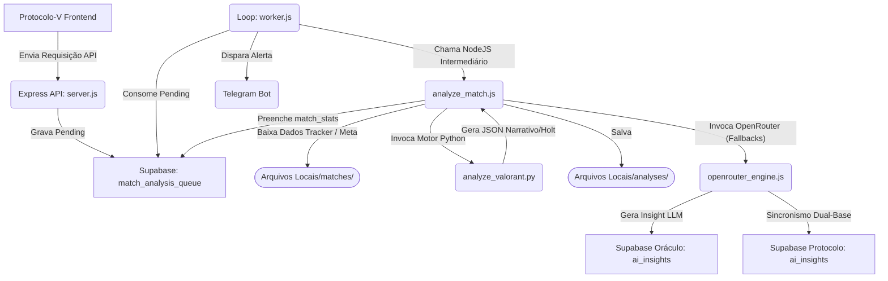

# ORÁCULO V // NÚCLEO_TÁTICO v4.0

O **Oráculo V** é um Motor de Análise Tática de Elite com arquitetura assíncrona, concebido como o cérebro analítico do ecossistema "Protocolo V". Seu propósito é processar e interpretar o desempenho tático de jogadores de Valorant, avaliando impacto contextual (Clutches, KAST, Trades, Tendências) em linguagem "brutalista terminal", entregando predições e conselhos via geração narrativa inteligente em Python.

---

## 🏗️ Arquitetura de Sistema



O projeto utiliza uma conexão simultânea (Multi-Base) com dois repositórios Supabase (Banco de Operações local e a Base Fonte Pública do Protocolo).

## 🚀 Guia de Instalação Passo a Passo

Os módulos em Python utilizam apenas bibliotecas padrão do sistema, resultando em um processo formal de dependências voltado primariamente aos scripts Node.

1. **Clone o repositório:**
   ```bash
   git clone https://github.com/rodolphoborges/oraculo-v.git
   cd oraculo-v
   ```

2. **Requisitos de Sistema:**
   - [Node.js](https://nodejs.org/) v18 ou superior.
   - [Python](https://www.python.org/) 3.9 ou superior (Necessário no PATH funcional).

3. **Crie o Ambiente e Instale Dependências NPM:**
   ```bash
   npm install
   ```

## ⚙️ Variáveis de Ambiente Necessárias

Crie um arquivo `.env` na raiz do projeto contendo as seguintes chaves essenciais:

```ini
# --- SUPABASE (Oráculo V - Banco Primário de Fila) ---
SUPABASE_URL=URL_do_projeto_Oraculo
SUPABASE_SERVICE_KEY=Sua_Service_Role_Privada

# --- SUPABASE (Protocolo V - Base Fonte de Jogadores) ---
PROTOCOL_SUPABASE_URL=URL_do_projeto_Protocolo
PROTOCOL_SUPABASE_KEY=Sua_Service_Role_do_Protocolo

# --- SEGURANÇA API INTERNA ---
ADMIN_API_KEY=Chave_Para_Acesso_de_Rotas_Master

# --- INTELIGÊNCIA ARTIFICIAL ---
OPENROUTER_API_KEY=Chave_Gratuita_Openrouter_Para_Llama3

# --- EXTRAS (Opcional) ---
PORT=3000
TELEGRAM_BOT_TOKEN=Token_Para_Avisos_Telegram
HENRIK_API_KEY=Opcional_Se_Usar_Radar_Legado
```

## 💻 Exemplos de Uso e Funções Principais

### 1. Via API e Fila Assíncrona (Produção)

Para ambientes de produção, suba simultaneamente o Worker (Motor) e o Server (API). 

**Terminal 1 (Worker Motor):**
Responde por monitorar o banco e disparar os Jobs em Python.
```bash
npm run worker
```

**Terminal 2 (Rotas de API):**
Responsável por interagir com o FrontEnd e receber chamadas em `/api/queue`.
```bash
npm start
```

**Exemplo de Enfileiramento via cURL:**
```bash
curl -X POST http://localhost:3000/api/queue \
  -H 'Content-Type: application/json' \
  -d '{"player": "Nick#Tag", "matchId": "UUID-DO-MATCH"}'
```
> [!TIP]
> No payload acima, substituir `"Nick#Tag"` por `"AUTO"` fará o Motor expandir e analisar todos os aliados presentes no grupo do jogador dono da partida.

### 2. Via Linha de Comando (Standalone)

Caso precise rodar testes de integração isolados ou forçar uma avaliação desconsiderando a fila:
```bash
node analyze_match.js "Nick#Tag" "UUID-DA-PARTIDA-OU-CAMINHO-JSON"
```
*A saída será um dump detalhado de um JSON formatado na saída padrão.*

## 📂 Estrutura e Manutenção

- `/scripts`: Rotinas úteis de diagnósticos e processamento em massa.
  - `backfill_history.js`: Varredor de histórico local para enfileiramento massivo de IA.
  - `backfill_dashboard.js`: Painel de monitoramento visual do Worker em tempo real.
  - `reprocess_completed_no_ai.js`: Reset de fila para jobs legados.
- `/docs`: Detalhes complexos das regras de negócio e fluxos sistêmicos.
  - [Manutenção e Diagnósticos (Worker Assíncrono)](./docs/worker_assincrono.md)
  - [Regras de Negócio e Matemática Tática (`analyze_valorant.py`)](./docs/analise_tatica.md)
- `worker.js`: Camada Resiliente (Self-Healing) que reprocessa análises.
- `lib/supabase.js`: Cliente Supabase Dual-Connection.

---
*(C) 2026 DEEPMIND ANTIGRAVITY // PROTOCOLO_V_OPERACAO_MAXIMA*
